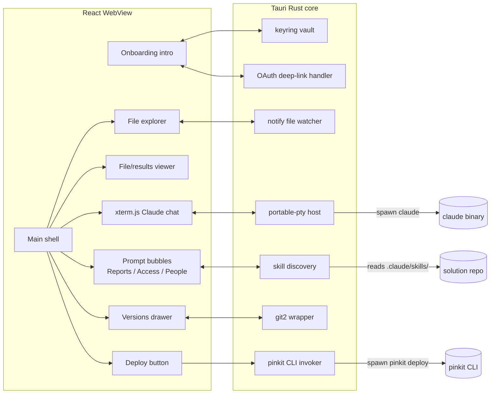

# PIN-5707: OpenIT Desktop Wrapper — Onboarding + Main Shell — Implementation Plan

**Ticket:** [PIN-5707](https://linear.app/pinkfish/issue/PIN-5707/pinkit-desktop-wrapper-onboarding-intro-page-connect-claude-code-slack)
**Date:** 2026-04-24
**Environment:** local (desktop app — no dev env)
**Worktree:** No
**Repos Affected:** `openit-app` (new repo: `pinkfish-ai/openit-app`)

---

## 1. Technical Investigation

This is a greenfield desktop app, so investigation focuses on the technical building blocks (not an existing codebase). Cross-cutting concerns: PTY fidelity, OAuth, OS keychain, and a build target that can ship to non-engineer admins on macOS first, Windows second.

### 1.1 Stack choice

- **Tauri 2.x** (Rust shell + WebView) — chosen in the concept doc (`research/itsm/pinkfish-itsm-concept.md` decision log 2026-04-24). Smaller binaries than Electron, native keychain access, system WebView.
- **React + Vite + TypeScript** — front-end inside the WebView. Familiar to web-team, same patterns as `pinkfish-ai/web`.
- **Tailwind + shadcn/ui** — utility-first styling, lightweight component primitives. Matches the look-and-feel direction in the mockups (rounded pills, simple cards).
- **xterm.js** — terminal renderer for the Claude Code chat pane. Industry standard, handles ANSI / resize / paste correctly.
- **portable-pty (Rust crate)** — host-side PTY for spawning `claude` and bridging stdin/stdout/resize to xterm.js over Tauri events.
- **notify (Rust crate)** — file-watcher for the file-explorer pane.
- **keyring (Rust crate)** — wraps macOS Keychain / Windows Credential Manager / Linux Secret Service. Used for Claude/Slack/Pinkfish tokens.
- **git2 (Rust crate)** *or* shell-out to `git` — for the Versions drawer (log/diff/restore). Lean toward `git2` for parsing, shell-out for `git restore`/`git checkout` to inherit user's git config.

### 1.2 Risk areas (from the wrapper plan)

1. **PTY-in-WebView fidelity** — the load-bearing risk. xterm.js + portable-pty is well-trodden (used by VS Code's terminal, Warp, Wave Terminal). Mitigation: M0 spike confirms paste/resize/Ctrl-C before the rest of the work begins.
2. **`claude` binary discovery & version drift** — don't bundle. Detect on PATH (`which claude`), prompt to install via `npm i -g @anthropic-ai/claude-code` or link to docs if missing. Version-skew handled by always invoking the user's installed binary.
3. **Auth on a desktop app** — Slack supports OAuth with a custom redirect URI (deep-link `openit://oauth/callback`), handled by a Tauri command that opens the system browser and listens on the deep-link. Pinkfish uses a PAT-paste flow for MVP — no callback or deep-link involved; the wrapper opens the Pinkfish "Generate API token" page in the system browser and the user pastes the token into the card.
4. **Skill discovery for prompt bubbles** — Claude Code skills live in `.claude/skills/` of the open repo (and `~/.claude/skills/`). The wrapper reads the skills dir via Rust `fs`, parses the `name:` and `description:` from each skill's frontmatter, and renders configurable pinned bubbles.

### 1.3 Architecture diagram

### 1.4 What already exists that's related

- The `pinkit` CLI (concept-stage; assumed to be a sibling deliverable — out of scope for this ticket but the wrapper invokes it).
- Claude Code skills directory format (`.claude/skills/<name>/SKILL.md` with YAML frontmatter `name`, `description`).
- No existing OpenIT code (greenfield repo created at `pinkfish-ai/openit-app`).

### 1.5 Data access patterns

All state is **local to the user's machine**:
- Keychain: tokens for Claude, Slack/Teams, Pinkfish.
- Disk: open solution repo (selected at first run / via "Open repo").
- App state: `state.json` inside Tauri's `app_data_dir()` (resolves to `~/Library/Application Support/ai.pinkfish.openit/` on macOS, `%APPDATA%\ai.pinkfish.openit\` on Windows, `~/.config/ai.pinkfish.openit/` on Linux). Stores last opened repo, pane sizes, pinned bubbles, completed-onboarding flag. Always read via `app.path().app_data_dir()` — never hardcode the OS path.

No server-side state for the wrapper itself. Pinkfish cloud is the deploy target only.

---

## 2. Proposed Solution

### 2.1 Approach

Ship the wrapper in three vertically sliced milestones, each runnable on its own:

- **M0 — Spike (PTY proof).** Tauri app boots with a single full-screen pane running an embedded `claude` session via portable-pty + xterm.js. Validates the load-bearing risk before investing in chrome.
- **M1 — Shell.** Three-pane layout (file explorer, viewer, chat), Versions drawer, Deploy button, prompt bubbles wired to insert text into the chat input.
- **M2 — Onboarding intro.** First-run page with three connect cards (Claude / Slack-or-Teams / Pinkfish), keychain storage, settings page to re-run, post-onboarding redirect to shell.

Each milestone is a separately reviewable PR. M0 lands first because if PTY fidelity is bad, the rest of the design changes.

### 2.2 Files to create

Greenfield, so this is the initial scaffold rather than a diff against an existing repo. Listed by area.

| File | Change |
|------|--------|
| `package.json`, `vite.config.ts`, `tsconfig.json`, `index.html` | Vite + React + TS scaffold |
| `tailwind.config.js`, `postcss.config.js`, `src/styles.css` | Tailwind setup |
| `src-tauri/Cargo.toml`, `src-tauri/tauri.conf.json`, `src-tauri/build.rs`, `src-tauri/src/main.rs` | Tauri shell, app metadata, build script |
| `src-tauri/src/pty.rs` | portable-pty host: spawn `claude`, bridge stdin/stdout/resize to/from front-end via Tauri events |
| `src-tauri/src/fs_watcher.rs` | notify-based watcher exposing tree + change events to front-end |
| `src-tauri/src/keychain.rs` | keyring wrapper: get/set/delete for `openit.claude`, `openit.slack`, `openit.teams`, `openit.pinkfish` |
| `src-tauri/src/git_history.rs` | git2 log/diff/restore for the open repo |
| `src-tauri/src/skills.rs` | scan `.claude/skills/` (project) + `~/.claude/skills/` (user), parse frontmatter, return list of `{name, description, slash_command, source}`. Project skills take precedence over user skills with the same name (dedupe by name, project wins) |
| `src-tauri/src/oauth.rs` | deep-link handler for `openit://oauth/callback`, exchanges code → token, writes to keychain |
| `src-tauri/src/cli.rs` | spawn `pinkit deploy`, stream output to front-end |
| `src-tauri/src/state.rs` | persisted app state (last repo, pane sizes, pinned bubbles, onboarding flag) |
| `src/App.tsx` | Top-level router: onboarding vs shell |
| `src/onboarding/IntroPage.tsx` | Three-card connect flow |
| `src/onboarding/ConnectClaudeCard.tsx` | Detect `claude`, surface install/login |
| `src/onboarding/ConnectChatCard.tsx` | Slack OAuth (Teams disabled with "coming soon") |
| `src/onboarding/ConnectPinkfishCard.tsx` | PAT-paste flow: open generate-token URL, accept token input, validate via `GET /me`, store in keychain |
| `src/shell/Shell.tsx` | Three-pane layout container |
| `src/shell/FileExplorer.tsx` | Read-only tree, click-to-open, "Open in editor" |
| `src/shell/Viewer.tsx` | YAML / JSON / markdown rendering; large-file guardrail |
| `src/shell/ChatPane.tsx` | xterm.js mounting + input forwarding |
| `src/shell/PromptBubbles.tsx` | Data-driven bubble strip; click → insert text into chat input |
| `src/shell/VersionsDrawer.tsx` | Git log / diff / restore UI |
| `src/shell/DeployButton.tsx` | Confirms env, invokes `pinkit deploy`, streams output to viewer |
| `src/shell/SettingsPage.tsx` | Re-run any of the three connects |
| `src/lib/tauri.ts` | Typed wrappers around `invoke()` calls |
| `src/lib/state.ts` | React state hooks backed by Tauri state.rs |
| `.github/workflows/ci.yml` | Lint + typecheck + Rust check + Tauri build (macOS) |
| `README.md`, `LICENSE` | Repo basics |

### 2.3 Unit tests

Front-end: Vitest + React Testing Library.

| File | Tests |
|------|-------|
| `ConnectClaudeCard.tsx` | Renders idle / detecting / found / missing / unauthenticated / authed states; clicking retry re-invokes detect |
| `ConnectChatCard.tsx` | Slack click invokes OAuth command; Teams shows "coming soon" and is disabled |
| `ConnectPinkfishCard.tsx` | "Generate token" button opens URL; pasted token validates via mocked `GET /me`; success state shows org; invalid token shows error |
| `IntroPage.tsx` | Continue button disabled until Claude + Pinkfish connected; Slack/Teams skippable |
| `FileExplorer.tsx` | Renders tree from a fixture; click invokes open-in-viewer; reflects watcher events |
| `Viewer.tsx` | YAML highlighting; large-file (>1MB) shows truncation banner |
| `ChatPane.tsx` | Mounts xterm; resize event forwards to backend (mocked invoke) |
| `PromptBubbles.tsx` | Renders from skill list fixture; click inserts slash command into chat input ref |
| `VersionsDrawer.tsx` | Log renders; clicking a commit shows diff (mocked); restore confirms before invoking |
| `DeployButton.tsx` | Prod env requires typed confirmation; dev env runs immediately |

Rust: `cargo test`.

| File | Tests |
|------|-------|
| `pty.rs` | Spawn a short-lived process (`echo`); resize event reaches PTY; stdout streams back |
| `keychain.rs` | Round-trip set/get/delete (gated on a test backend, since real keyring requires user interaction) |
| `git_history.rs` | Against a fixture repo: log returns commits in order; diff parses; restore moves HEAD |
| `skills.rs` | Parses a fixture `SKILL.md` frontmatter; returns name/description/slash_command |
| `state.rs` | Persists and reloads pane sizes, pinned bubbles, onboarding flag |

No coverage for `oauth.rs` / `cli.rs` beyond compile-checks — both are thin wrappers around shell-out / system browser. Smoke-tested manually in M2 and Phase 4.

### 2.3.1 OAuth & token-flow failure modes

Each connect card handles four failure axes explicitly:

| Failure | Detection | UX |
|---|---|---|
| User abandons / closes browser | OAuth/PAT card stays in `awaiting-user` for 5 min then shows "Didn't finish? Try again" with a Retry button | Retry resets the card to `idle` |
| Deep-link callback never fires (Slack only) | 5-minute timeout in `oauth.rs` after `open(authorize_url)` | Card surfaces "Couldn't receive callback. Make sure OpenIT is set as a handler for `openit://` and try again." with Retry |
| Token exchange returns non-2xx | `oauth.rs` / PAT validator parses the response; surfaces upstream error code + message | Card shows the error inline, keeps the user in the card; logs to viewer |
| Network error during exchange / validation | Caught in `oauth.rs` / `lib/tauri.ts` | "Couldn't reach Slack/Pinkfish. Check your connection." + Retry |
| Token validates but lacks required scope | Post-token `GET /me` (Pinkfish) or `auth.test` (Slack) checks scope; missing scope → fail | "Token is valid but missing scope `<X>`. Re-authorize with full permissions." |
| Keychain write fails (locked / denied) | `keychain.rs` returns error to FE | Card shows "Couldn't save credential. Unlock your keychain and try again." — token kept in memory for the session as a fallback so the user isn't blocked |

All failures keep the user on the same card and never silently drop them back to the previous step. None auto-retry — every retry is user-initiated.

### 2.4 Integration / end-to-end tests

Phase 4 testing for a desktop app is "launch the .app and click through":

- Build a signed dev `.dmg` on macOS via `tauri build --debug`.
- Manual checklist: first-run onboarding completes; shell renders with the three panes; PTY accepts paste, Ctrl-C, resize; bubbles insert text; Versions drawer browses commits; Deploy button confirms env; close + reopen restores state; close wrapper, open repo in terminal, confirm `claude` and `pinkit` work — graduation path proven.
- Automated: a Playwright-style end-to-end is tractable via `tauri-driver` but is overkill for the MVP. Defer to v2.

---

## 3. Implementation Checklist: OpenIT Onboarding + Shell

### Step 0: Repo scaffold

Get a working `openit-app` repo with Tauri + React + Tailwind boilerplate that builds on macOS.

- [x] `npm create tauri-app@latest` with React + TypeScript + Vite template
- [ ] Add Tailwind + shadcn/ui + base components (Card, Button, Dialog) *(deferred to M1 — M0 uses minimal CSS)*
- [x] Configure `tauri.conf.json`: bundle id `ai.pinkfish.openit`, productName `OpenIT`
- [ ] Deep-link scheme `openit://`, broader fs/path/shell/event capabilities *(deferred to M2 — not needed for PTY spike)*
- [ ] CI workflow: lint + typecheck + `cargo check` + `tauri build` on macOS runner *(deferred — adding alongside the M0 PR)*
- [x] First commit, push to `pinkfish-ai/openit-app`

### Step 1: M0 — PTY spike

Prove embedded `claude` works before investing in chrome.

- [x] `pty.rs`: spawn arbitrary shell command via portable-pty; bridge stdin/stdout/resize to front-end events
- [x] `ChatPane.tsx`: xterm.js mounted full-screen; wired to PTY events
- [x] Hardcoded spawn: `claude` if on PATH, else user `$SHELL`, else `bash`
- [ ] Manual validation: paste, Ctrl-C, resize, color output, bracketed paste — all behave
- [x] Unit tests for `pty.rs` (resolve_command override + fallback)
- [ ] **Decision gate:** if any of the above feel broken, stop and revisit (xterm.js + portable-pty alternatives). Do not proceed to M1 until PTY feels native.

### Step 2: M1 — Shell layout

Three-pane shell with the surrounding chrome.

- [ ] `Shell.tsx` — three resizable panes (react-resizable-panels), persisted sizes
- [ ] `FileExplorer.tsx` + `fs_watcher.rs` — tree from selected repo, watcher pushes change events
- [ ] `Viewer.tsx` — YAML / JSON / markdown rendering; large-file banner
- [ ] `ChatPane.tsx` (from M0) — moved into right pane
- [ ] `PromptBubbles.tsx` + `skills.rs` — read skills, render bubbles, click inserts slash command
- [ ] `VersionsDrawer.tsx` + `git_history.rs` — log/diff/restore
- [ ] `DeployButton.tsx` + `cli.rs` — invoke `pinkit deploy`, stream to viewer; prod confirmation modal
- [ ] **`pinkit` CLI stub** — add a minimal `scripts/pinkit-stub.sh` that echoes phased deploy output and exits 0; `cli.rs` resolves `pinkit` from PATH and falls back to the stub when `OPENIT_PINKIT_STUB=1` is set. Unblocks local development before the real `pinkit` CLI ships
- [ ] `state.rs` — persisted pane sizes + pinned bubbles
- [ ] Unit tests per the table in §2.3
- [ ] Manual validation against the mockup

### Step 3: M2 — Onboarding intro

First-run flow + settings.

- [ ] `IntroPage.tsx` with three cards
- [ ] `ConnectClaudeCard.tsx` — detect on PATH, surface install/login
- [ ] `ConnectChatCard.tsx` — Slack OAuth via `oauth.rs`; Teams disabled
- [ ] `ConnectPinkfishCard.tsx` — PAT-paste flow
- [ ] `keychain.rs` — get/set/delete for the four token slots
- [ ] `oauth.rs` — deep-link handler for `openit://oauth/callback`
- [ ] `state.rs` — onboarding-completed flag drives initial route in `App.tsx`
- [ ] `SettingsPage.tsx` — re-run any connect
- [ ] Unit tests per §2.3
- [ ] Manual validation: full first-run flow on a clean machine

---

## 4. Resolved decisions

1. **Claude binary** — detect-and-reuse the user's existing install. Don't bundle, don't auto-install. If missing, surface install instructions and a re-check button.
2. **Slack app** — reuse the existing Pinkfish-owned Slack app. Action item: confirm client_id + scopes with whoever owns it; add `openit://oauth/callback` to its redirect-URI allowlist.
3. **Pinkfish auth — decision: PAT-paste for MVP.** The Pinkfish cloud auth server does not currently expose a device-code endpoint, and adding one is platform-side work that would block this ticket. For MVP, the Connect Pinkfish card opens the user's Pinkfish web profile in the system browser ("Generate API token"), the user pastes the token into the card, the wrapper validates it with a `GET /me` call, then stores it in the OS keychain. A separate ticket (`platform: device-code OAuth endpoint`) is filed to add device-code later; once it ships, the card upgrades transparently with no schema migration.
4. **Code signing** — deferred to a separate ticket. M0/M1/M2 ship unsigned for internal use; sign before first external/design-partner handoff. Tauri is cross-platform out of the box — same Rust + React compiles to macOS `.dmg`, Windows `.msi`, Linux `.AppImage`. The `keyring` crate already abstracts macOS Keychain / Windows Credential Manager / Linux Secret Service, so no per-OS code branches.
5. **Sequencing** — one PR per milestone (M0 / M1 / M2), each independently reviewable.

Step 4 (Polish + package) is removed from this ticket and tracked separately.

## 5. STOP — please review

Plan ready for human review. Once approved I'll run `review_plan` and proceed to Phase 2.

---

## Plan Review Findings

**Gate:** Plan Review
**Changes made:** Two minor clarifications to remove implementation ambiguity before Phase 3.

| Finding | Error type |
|---------|------------|
| App-state path was hardcoded to a macOS path. Switched to Tauri's `app_data_dir()` so the same code works on macOS / Windows / Linux without per-OS branches. | omission |
| Skill discovery scanned both `.claude/skills/` (project) and `~/.claude/skills/` (user) but didn't define behavior when the same skill name appears in both. Defined: project wins, dedupe by name. | omission |

No multi-step workaround risks beyond the PAT-paste flow (already covered with explicit failure-mode handling in §2.3.1). No layering issues — Rust modules own OS/system concerns, React owns UI, `lib/tauri.ts` is the single typed bridge. No backwards-compat concerns (greenfield repo).
