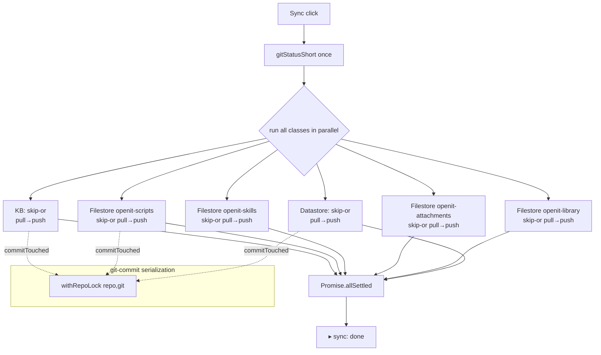

# PIN-5865: Sync — skip clean entity classes, parallelize remote checks — Implementation plan

**Ticket:** [PIN-5865](https://linear.app/pinkfish/issue/PIN-5865/sync-skip-clean-entity-classes-parallelize-remote-checks)
**Date:** 2026-04-30
**Repo:** `openit-app` (primary)
**References:** none — this work is local to `src/lib/` sync engine. No `/web` plugin script changes.
**Predecessor:** PIN-5775 manifest-persistence + delete-reconcile work currently on `fix/sync-local-delete-reconcile` (PR #99). Branched from that branch; will rebase onto main after #99 lands.

---

## 1. Technical investigation

### Current shape of `pushAllEntities`

`src/lib/pushAll.ts:26–214` runs six serial passes against three adapter families:

| # | Phase | File / lines |
| --- | --- | --- |
| 1 | KB pre-push pull (all collections at once via `pullAllKbNow`) | `pushAll.ts:56–67` |
| 2 | KB push, **looped sequentially** per collection | `pushAll.ts:81–97` |
| 3 | Filestore pre-push pull, **looped sequentially per collection** via `filestorePullOnce` | `pushAll.ts:124–155` |
| 4 | Filestore push, sequentially per collection | `pushAll.ts:158–171` |
| 5 | Datastore pre-push pull (single call) | `pushAll.ts:180–201` |
| 6 | Datastore push (single call) | `pushAll.ts:203–211` |

Every phase runs unconditionally regardless of whether the user touched anything in that scope. With ~150–300 ms RTT to `skills-stage.pinkfish.ai`, the no-op case still pays ~3 s of pure round-trip waiting (six list-remote calls in series).

### Existing primitives we'll lean on

- **`withRepoLock(repo, prefix, fn)`** — `syncEngine.ts:244–260`. Map-keyed FIFO queue, key is `${prefix}:${repo}`. Already used with prefixes `"kb"`, `"filestore"`, `"datastore"`, `"agent"`, `"workflow"`. Adding `"git"` is namespace-safe.
- **`pushOne` wrapper** — `syncEngine.ts:1474–1522`. Wraps every per-adapter `pushOne` (KB / filestore / datastore) in `withRepoLock(repo, adapter.prefix)`. So `pushAllToKb` and `pushAllToFilestore` already serialize per-prefix at the lock layer — only the imperative for-loop in `pushAll.ts` enforces the cross-prefix serial order.
- **`pullEntity`** — `syncEngine.ts:484–508`. Same pattern: wrapped in `withRepoLock(repo, adapter.prefix)`.
- **`commitTouched(repo, paths, message)`** — `syncEngine.ts:450–461`. Single git-commit funnel called from three places:
  - `syncEngine.ts:777–780` — engine pull pipeline (`sync: pull @ <ts>`), inside the per-prefix lock.
  - `kbSync.ts:342–346` — KB push (`sync: deployed @ <ts>`), inside the per-prefix lock via `pushOne`.
  - `filestoreSync.ts:396–401` — filestore push, ditto.
  - Datastore push does **not** call `commitTouched` (writes are JSON-row updates, no per-row commit).

  The git-index race only exists between *different* prefixes' commits — which today can't happen because `pushAll.ts` is serial. Once we parallelize, kb-push commit and filestore-pull commit can both be inside their own prefix lock yet hit `git_commit_paths` simultaneously. That's the `.git/index.lock: File exists` failure mode the ticket calls out.
- **Dirty detection** — `kbSync.ts:194–213` and `filestoreSync.ts:194–199`. Combines `gitStatusShort(repo)` (filtered to the collection's `dir/` prefix) with the manifest's `pulled_at_mtime_ms`. Identical pattern in both adapters.
- **`gitStatusShort(repo)`** — `src/lib/api.ts:62`. Tauri `git_status_short` invoke; one shell-out per call. Cheap (single git plumbing call) but worth calling once per sync click and threading the result down rather than calling it 4× across collections.
- **Conflict aggregate** — `syncEngine.ts:276–312`. `conflictsByPrefix: Map<string, AggregatedConflict[]>`. To answer "are there entries for this prefix?" we read `conflictsByPrefix.get(prefix)?.length ?? 0`. Need a small read-only accessor (`hasConflictsForPrefix(prefix: string): boolean`) — already symmetric with the existing `clearConflictsForPrefix`.

### Skip-clean detection

Definition of "clean scope" the engine needs to satisfy (per ticket Desired Outcome §1):

- `git status --short` shows zero entries whose path falls under the scope's working-tree prefix:
  - KB collection: `knowledge-bases/<displayName>/`
  - Filestore collection: `filestores/<collectionName>/`
  - Datastore: `databases/`
- AND `conflictsByPrefix` has zero entries for the adapter prefix (`"kb"` / `"filestore"` / `"datastore"`).

When clean: skip both the pre-push pull *and* the push. The 60s background poller (`syncEngine.ts:801+`) handles remote-side adds/deletes. This is the explicit trade the ticket makes.

### Parallelism shape

`pullAllKbNow` (KB pre-push pull) currently pulls all collections in one engine call (single `withRepoLock(repo, "kb")` lock). Keep that — it's already correct, and the kb adapter pulls a `kb` aggregate, not per-collection. The parallelism boundary for KB is "all KB collections together vs other entity classes". For filestore, pull and push are per-collection so they parallelize at the collection level.

### Cross-repo / plugin-script reach

None. `scripts/openit-plugin/sync-push.mjs` writes a trigger file; the actual pipeline runs from `pushAllEntities`. No `/web` mirror needed.

---

## 2. Proposed solution

### Approach

1. **Introduce `withRepoLock(repo, "git")` at the `commitTouched` boundary.** One-line wrap inside `commitTouched` itself — every commit site (engine pull + kb push + filestore push) automatically benefits, with no caller-side change. This is the smallest blast-radius fix for the index-lock race.
2. **Pre-flight a single `gitStatusShort(repo)` call** at the top of `pushAllEntities`, then derive per-scope dirty sets locally by string-prefix filter. One shell-out instead of four.
3. **Add `hasConflictsForPrefix(prefix)` accessor** to `syncEngine.ts` so `pushAll.ts` can ask the conflict aggregate.
4. **Add `isScopeClean(args)` helper** (private to `pushAll.ts`) that combines all three skip preconditions:
   1. `git status --short` reports zero entries under the scope's working-tree prefix, **AND**
   2. `hasConflictsForPrefix(prefix)` returns false, **AND**
   3. **the per-collection manifest is non-empty** (a previous successful pull populated it), **AND**
   4. **no `.server.` shadow files exist under the scope.** Shadow files are gitignored so `git status` won't surface them. KB already has `kbHasServerShadowFiles`; add a parallel `filestoreHasServerShadowFiles` (one-line wrapper around the same disk scan in `filestoreSync.ts`).

   All four must hold to skip both pull and push. (3) handles the bootstrap edge case — a freshly-resolved collection with empty manifest must pull at least once before skip-clean can apply, even though working tree may also be empty/clean. (4) handles the after-restart case where in-memory conflict aggregate is empty but unresolved shadow files exist on disk.
5. **Restructure `pushAllEntities` into a `Promise.allSettled` over per-class async tasks.** Each task internally runs its pre-push pull → conflict gate → push, **wrapped in its own try/catch** so a sub-task failure surfaces via `onLine("✗ …")` instead of being silently dropped by `allSettled`. Log lines stream in completion order — already prefixed (`▸ sync: kb …`, `▸ sync: filestore (X) …`) so out-of-order arrival stays comprehensible (success criterion §3).
6. **Emit a final `▸ sync: done` after the join.** Keep the existing `▸ sync: starting push to Pinkfish` head line.

The "skip" decision is per-class (or per-collection inside filestore). KB's "skip" means "skip the entire kb-aggregate pre-push pull AND every per-collection push" — when every KB collection is clean by all four criteria, no collection inside it is dirty by definition. If any single KB collection fails the skip-test, the whole KB pre-push pull runs (because `pullAllKbNow` is whole-class).

### Files to modify

| File | Change |
| --- | --- |
| `src/lib/syncEngine.ts` | Wrap `commitTouched` body in `withRepoLock(repo, "git", …)`. Add `hasConflictsForPrefix(prefix: string): boolean` exported accessor. |
| `src/lib/pushAll.ts` | Replace serial for-loops with `Promise.allSettled` of per-class tasks (each wrapped in its own try/catch). Add a single `gitStatusShort(repo)` pre-flight. Add private `isScopeClean({ dirtyPaths, scopeDir, prefix, manifestNonEmpty, hasShadow })` helper that ANDs the four preconditions. Keep all existing `onLine` log strings byte-for-byte where possible; add `▸ sync: <class> skipped (clean)` lines for transparency. |
| `src/lib/kbSync.ts` | No code change for parallelism (already lock-wrapped). Export a small accessor that lets `pushAll.ts` see whether each collection's manifest is non-empty without a fresh disk read (e.g., reuse `loadCollectionManifest` once per scope-decision). |
| `src/lib/filestoreSync.ts` | Add `filestoreHasServerShadowFiles(repo, collection)` — symmetric to `kbHasServerShadowFiles`, scans `filestores/<col>/` for `*.server.*` siblings. Same accessor pattern as KB for manifest-non-empty. |
| `src/lib/__tests__/syncEngine.test.ts` | Add regression: **"file pulled from remote and never modified locally is not pushed on the next sync."** Setup: pull a file via the engine → manifest gets `pulled_at_mtime_ms = M`, file on disk has `mtime = M`. Run push. Assert `kbUploadFile` was NOT called for that file. (Pins ticket Success Criterion §2 verbatim — narrower than the earlier "bumped mtime, identical content" framing, which would have asserted a behavior change the ticket doesn't actually request.) |
| `src/lib/__tests__/push-no-replication.test.ts` | Add: "no-op sync click against fully-synced state issues zero remote requests for clean scopes". Setup: 1 kb collection, 1 filestore collection, datastore — all in synced state with non-empty manifests, working tree clean, conflict aggregate empty, no shadow files. Mock `kbListRemote` / `filestoreListRemote` / datastore fetch. Run `pushAllEntities`. Assert all three list-remote mocks have zero calls. |
| `src/lib/__tests__/push-no-replication.test.ts` | Add: "freshly-resolved collection with empty manifest still pulls". Setup: collection registered but manifest empty. Working tree clean, no conflicts. Run `pushAllEntities`. Assert pre-push pull DID run (skip-clean must NOT trigger when manifest is empty — bootstrap path). |
| `src/lib/__tests__/push-no-replication.test.ts` | Add: "shadow files block skip-clean". Setup: synced state with non-empty manifest, working tree clean, conflict aggregate empty, BUT one `.server.` shadow file on disk. Run `pushAllEntities`. Assert pre-push pull DID run (and surfaces the conflict). |
| `src/lib/__tests__/push-no-replication.test.ts` | Add: "one slow class does not block siblings". Setup: 3 entity classes with work; KB's `listRemote` returns after 200ms delay; filestore + datastore return immediately. Capture timestamps when each class emits its push-complete `onLine`. Assert filestore + datastore complete before KB. |
| `src/lib/__tests__/push-no-replication.test.ts` | Add: "git commit serialization". Setup: 2 classes pushing in parallel, each with one file touched. Stub `gitCommitPaths` with a 50ms delay and a counter that throws if it sees `> 1` concurrent invocation. Run `pushAllEntities`. Assert no throw. |
| `src/lib/__tests__/push-no-replication.test.ts` | Add: "sub-task failure surfaces via onLine". Setup: stub kb push to throw mid-flight. Run `pushAllEntities`. Assert `▸ sync: done` still fires AND a `✗ sync: kb …` line appears. (Pins the per-task try/catch around `Promise.allSettled`.) |

### Manual scenarios

Run from a fully-synced openit-app working tree against `skills-stage.pinkfish.ai`:

1. **No-op click.** With zero local changes and no conflicts: click Sync. Expect `▸ sync: done` within < 1 s wall-clock and no per-class push lines beyond the skip notice. Verify network panel shows zero `skills*.pinkfish.ai` requests during this click.
2. **Single-class change.** Edit one file under `knowledge-bases/<col>/`. Click Sync. Expect kb pull + push lines; expect filestore + datastore lines to print "skipped (clean)".
3. **Multi-class change.** Edit one kb file and one filestore file. Click Sync. Expect both classes to run; log lines may interleave by completion order, but each line is prefixed and parseable.
4. **Slow-listRemote intentional regression** (manual via temporary `await new Promise(r => setTimeout(r, 3000))` in `kbListRemote`). Confirm filestore + datastore push lines print before the KB lines.
5. **Index-lock stress.** Run 100 syncs in a row against a state with 3-class changes (a small bash loop calling the sync trigger). Confirm zero `.git/index.lock: File exists` errors.
6. **Background poller still works.** After a no-op click, modify a file remotely (via Pinkfish dashboard). Wait < 60 s. Confirm the next poll surfaces it without requiring another sync click. (Pins the ticket's stated trade-off: skipping the pre-push pull is safe because the poller still runs.)

### Cross-repo plugin steps

None — no files under `scripts/openit-plugin/` are touched.

---

## 3. Implementation checklist

### Step 1 — Foundation: git-commit serialization + conflict accessor

Smallest change first; everything else depends on the index-lock fix being in place.

- [ ] Wrap `commitTouched` body in `withRepoLock(repo, "git", …)` (`syncEngine.ts:450–461`).
- [ ] Add `hasConflictsForPrefix(prefix: string): boolean` next to `clearConflictsForPrefix` (`syncEngine.ts:308–312`).
- [ ] Run existing vitest suite to confirm no regression from the `commitTouched` wrap (the lock-around-commit is purely additive; existing tests should pass unchanged).

### Step 2 — Skip-clean detection

- [ ] Pre-flight one `gitStatusShort(repo)` call at the top of `pushAllEntities`.
- [ ] Add `filestoreHasServerShadowFiles` mirror of the KB version.
- [ ] Add private `scopeIsClean({ dirtyPaths, scopeDir, prefix, manifestNonEmpty, hasShadow })` helper inside `pushAll.ts` — all four preconditions must hold.
- [ ] Wire skip-checks into KB / filestore / datastore branches; emit `▸ sync: <class> skipped (clean)` lines so the pane stays informative.

### Step 3 — Parallelize

- [ ] Refactor each entity-class branch into a self-contained async function with its own try/catch around the pull → conflict-gate → push flow.
- [ ] Replace the top-level imperative flow with `await Promise.allSettled([kbTask(), ...filestoreTasks(), datastoreTask()])`.
- [ ] Verify `▸ sync: done` only fires after the join.

### Step 4 — Tests

- [ ] Add the seven new vitest cases listed in the table above.
- [ ] `pnpm vitest run` clean.
- [ ] `cargo test --manifest-path src-tauri/Cargo.toml` clean (no Rust changes expected, but run for hygiene).

### Step 5 — Manual sign-off

- [ ] Click-through scenarios 1–6 above. Capture timing for scenarios 1 and 3 in the Linear ticket comment.

---

## 4. Stop — request human review before stage 03

This plan is the contract. Do not start writing code until the human approves.

---

## BugBot Review Log

### Iteration 1 (2026-04-30)

| # | Finding | Severity | Disposition | Commit / Reason |
|---|---------|----------|-------------|-----------------|
| 1 | Concurrent filestore collections share global conflict state | Medium | Fixed | `a9be184` — added `getConflictsForPrefix(prefix)` accessor + per-collection conflict gate. Also fixed a related bug found while triaging: skip-clean was passing class-level strings (`"kb"`, `"filestore"`) to `hasConflictsForPrefix` but adapter prefixes are per-collection paths — the conflict precondition was effectively a no-op. |
| 2 | Exported `filestoreHasServerShadowFiles` is never used | Low | Fixed | `255c112` — dropped the unused export. CLAUDE.md "every new export must have a caller". |
